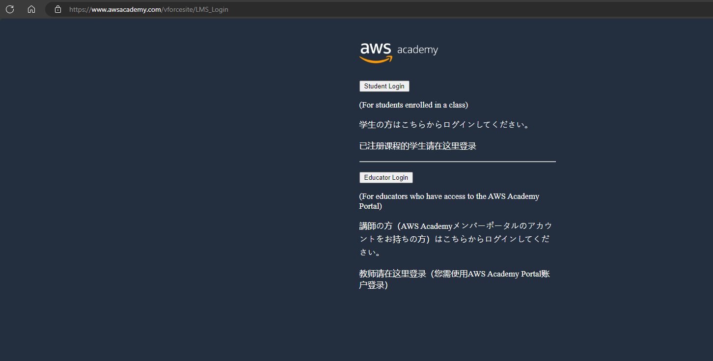
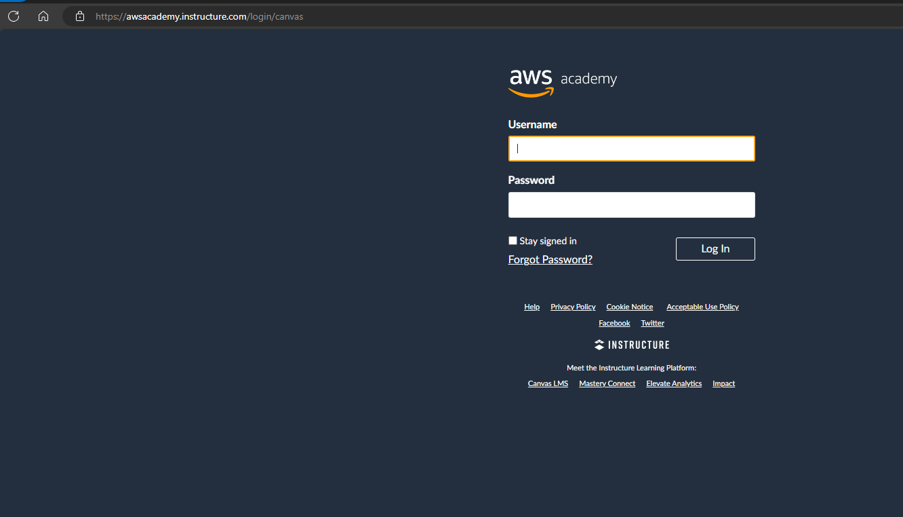
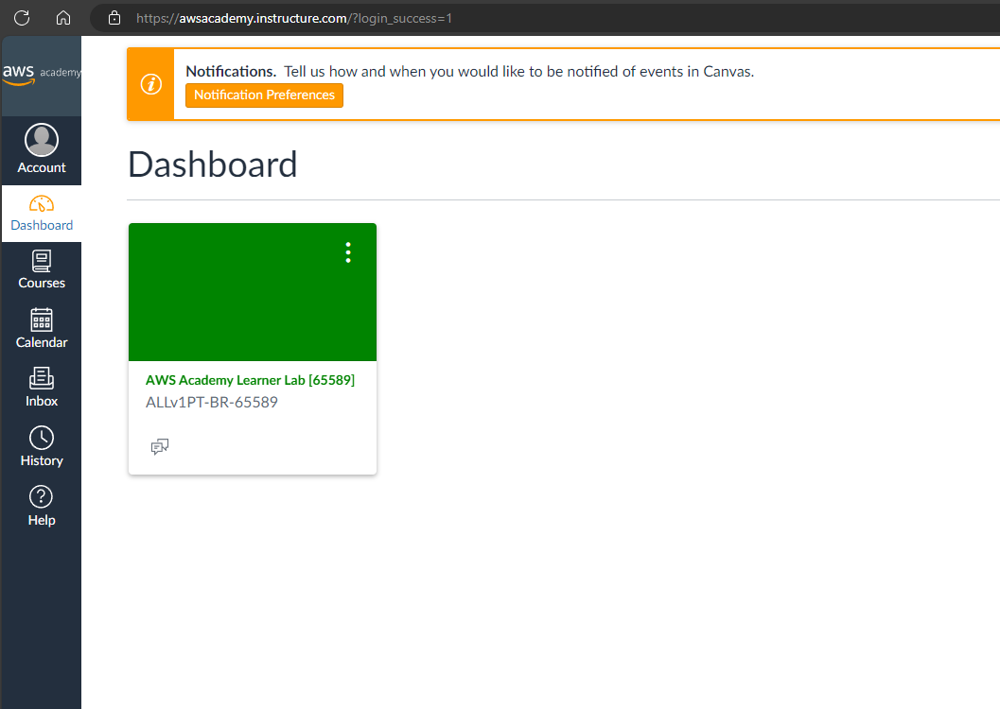
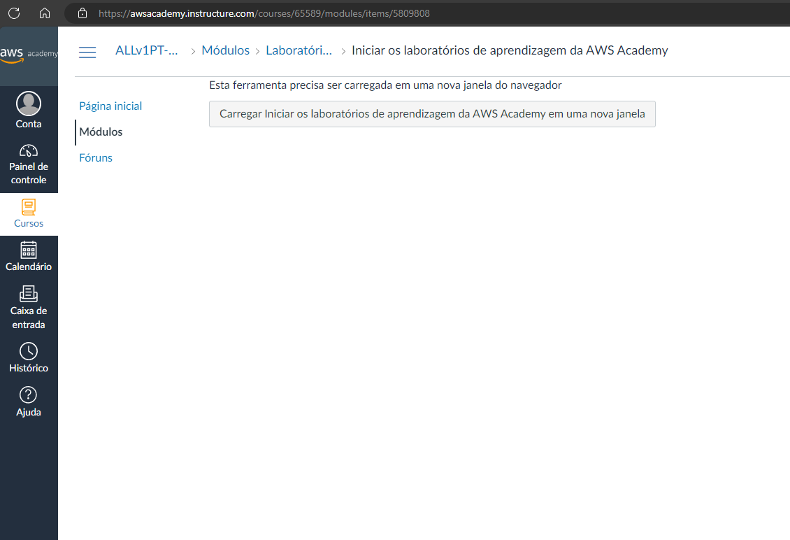
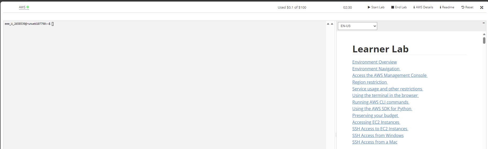
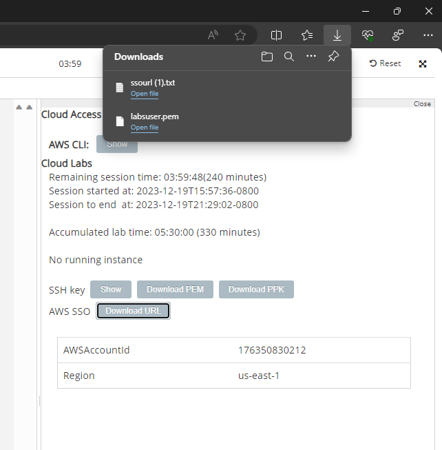

# Trabalho Kubernetes

Este trabalho tem o intuito de validar os conhecimentos apresentados na disciplina de Microcontainers. Nele iremos demonstrar como criar uma estrutura de kubernetes para hospedar um site WordPress com MySQL.

## Acessando AWS Academy

1. Para executar este laboratório, utilizaremos o ambiente da AWS Academy oferecido pela FIAP para configurar uma instância de EC2. Para acessar a URL `https://www.awsacademy.com/vforcesite/LMS_Login` para entrar na página de login.

2. Ao acessar página de login, você precisará escolher o tipo de autenticação. No nosso caso, será a autenticação de aluno.
   

3. Ao escolher a opção de login para alunos, você precisará utilizar seu e-mail da FIAP junto da senha previamente cadastrada.
   

4. Após se autenticar, você será redirecionado ao dashboard do AWS Academy, onde será possível visualizar o curso que possibilitará acessar o ambiente desejado.
   

5. Ao clicar no curso, você será redirecionado para a página do mesmo, nele você poderá acessar o menu de Módulos que listará os módulos do curso, nele você clicará no passo `Iniciar os laboratórios de aprendizagem da AWS Academy` do módulo de `Laboratório de aprendizagem da AWS Academy`,
   

6. Ao acessar, você verá um botão que te redirecionará ao ambiente do laboratório, basta clicar no botão apresentado no centro da tela.
   

7. Ao carregar a tela, você deverá clicar no botão `Start Lab` para iniciar sua sessão dentro da plataforma da AWS. Precisará aguardar alguns instantes até que plataforma seja devidamente inicializada.
   

8. Para possibilitar o acesso do ambeite criado no passo anterior, você precisará baixar a chave PEM para possibilitar autenticar no EC2 que criaremos, junto da URL de acesso da plataforma criada.
   

9. Para finalizar esta etapa, basta acessar a URL dentro do arquivo `ssourl.txt` baixado na etapa anterior, ele te redirecionará para o portal da AWS.

## Criando um EC2

a

## Instalando GIT

a

## Instalando K3S

a

## Aplicando configurações

a

## Configurando acesso HTTP externo

a

## Testando instalação

a
