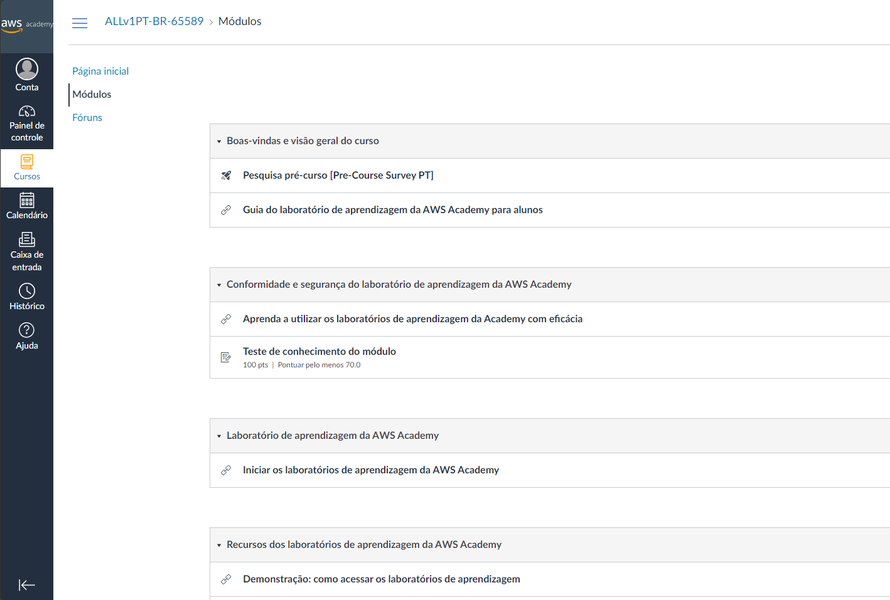

# Trabalho Kubernetes

Este trabalho tem o intuito de validar os conhecimentos apresentados na disciplina de Microcontainers. Nele iremos demonstrar como criar uma estrutura de kubernetes para hospedar um site WordPress com MySQL. Você poderá encontrar este trabalho no repositório do [GitHub](https://github.com/arthuraugsten/microcontainers).

## Acessando AWS Academy

1. Para executar este laboratório, utilizaremos o ambiente da AWS Academy oferecido pela FIAP para configurar uma instância de EC2. Para acessar a URL `https://www.awsacademy.com/vforcesite/LMS_Login` para entrar na página de login.

2. Ao acessar página de login, você precisará escolher o tipo de autenticação. No nosso caso, será a autenticação de aluno.
   

3. Ao escolher a opção de login para alunos, você precisará utilizar seu e-mail da FIAP junto da senha previamente cadastrada.
   

4. Após se autenticar, você será redirecionado ao dashboard do AWS Academy, onde será possível visualizar o curso que possibilitará acessar o ambiente desejado.
   

5. Ao clicar no curso, você será redirecionado para a página do mesmo, nele você poderá acessar o menu de Módulos que listará os módulos do curso, nele você clicará no passo `Iniciar os laboratórios de aprendizagem da AWS Academy` do módulo de `Laboratório de aprendizagem da AWS Academy`,
   

6. Ao acessar, você verá um botão que te redirecionará ao ambiente do laboratório, basta clicar no botão apresentado no centro da tela.
   

7. Ao carregar a tela, você deverá clicar no botão `Start Lab` para iniciar sua sessão dentro da plataforma da AWS. Precisará aguardar alguns instantes até que plataforma seja devidamente inicializada.
   

8. Para possibilitar o acesso do ambeite criado no passo anterior, você precisará baixar a chave PEM para possibilitar autenticar no EC2 que criaremos, junto da URL de acesso da plataforma criada.
   

9. Para finalizar esta etapa, basta acessar a URL dentro do arquivo `ssourl.txt` baixado na etapa anterior, ele te redirecionará para o portal da AWS.

## Criando um EC2

Para a execução do laboratório estamos usando um EC2 (Elastic Compute Cloud) oferecido pela AWS. Este é serviço de Virtual Machine que utilizaremos para a instalação e configuração do laboratório.

1. Como primeiro passo, usaremos o campo de busca para encontrar a categoria desejada para iniciar o processo de instalação.
   

2. Após acessar o menu, basta clicar no no botão Launch instance dentro do menu `EC2 Dashbaord`. Com isso, iniciaremos o processo para provisioná-lo.
   

3. Agora iniciaremos o processo de criação, para o processo informaremos os seguintes valores:

   - **Nome**: Como primeiro valor requerido, inforaremos o nome do recurso, para o laboratório usaremos `microcontainers`.
   - **Image**: Como sistema operacional, escolheremos a imagem base do Ubuntu.

   

   - **Instance type**: Para o instance type, escolheremos o tamanho `t2.large` para termos recursos suficientes para subir todos os serviços requeridos com redundância.
   - **Key pair**: Este valor deixaremos com o valor padrão preenchido pelo formulário.
     

   - **Networking**: Para fins didáticos, habilitaremos a conexxão SSh de qualquer endereço IP. Lembrando que esta opção não deve ser usada em ambientes produtivos.

   

   - Após preencher os dados informados nos passos anteriores, informe o número de instâncias como 1 e clique em launch instance para iniciar o processo de provisionamento.
     

4. Após iniciar o processo, você será redirecionado para uma página onde mostrará o progresso de criação da instância de EC2.
   

5. Uma vez concluído, você poderá acessar novamente o menu de EC2 e acessar a opção de Instances. Assim você verá a instância recem criada. Com isso, concluímos o provisionamento do recurso computacional que será usado neste laboratório.
   

## Conectando no EC2

1. Para configurar o cluster de Kubernetes, primeiro teremos que acessar o recurso através de uma conexão SSH. Para isso, teremos que obter o endereço de IP público criado para o recurso. Ao clicar no registro da listagem mostrando a instância criada, copie o valor do campo `Public IPv4 IP` e armazene-o para a próxima etapa.

   

2. Abra o terminal e digite o seguinte comando `ssh -i <caminho-arquivo-baixado>.pem ubuntu@<ip-publico-ec2>`. Após executar o comando, a conexão será iniciada.
   

## Instalando GIT

1. Nesta etapa, instalaremos o GIT para baixar os arquivos de deployment do laboratório. Para isso, execute o seguinte comando: `sudo apt-get install git`. _O IP mostrado mostrado na imagem é de uma instalação anterior a executada nos passos anteriores, podendo desconsiderar._
   

2. Após a instalação, execute o comando `git clone https://github.com/arthuraugsten/microcontainers.git` para baixar os arquivos do repositório git.

## Instalando K3S

1. Para a instalação do K3s, utilizaremos o script `install-k3s.sh`. Para executá-lo, basta executar o comando `sudo microcontainers/install-k3s.sh`.

## Aplicando configurações

1. Para a configuração do wordpress, executaremos o comando de apply oferecido pela API do kubectl configurando-o para buscar todos arquivos YAML do diretório clonado. Para isso, execute o comando `cd microcontainers` para acessar o diretório clonado e então `kubectl apply -f .` para executar todas as configurações.

2. Para acompanhar o provisionamento dos recursos, execute o comando `kubectl get deployment -o wide -w`, uma vez que todos estiverem com o status `ready`, precione `CTRL-C` para cancelar o comando de observação.

Neste processo, nós criamos todos os recursos necessários (service/secret/ingress) para o provisionamento. Como armazenamento persistente, utilizamos o próprio local storage a fins de simplicidade e também configuramos o website para termos 2 instâncias. Assim, permitindo alta disponibilidade.

## Configurando acesso HTTP externo

Nesta etapa configuramos o acesso externo, assim, possibilitando acessarmos a aplicação criada através do endereço público.

1. Para isso, acesse as informações da instância de EC2, selecione a instância em execução e clique na guia `Security` para acessar as informações de rede. Nesta guia, clique no link do campo Security Groups. Este recurso é responsável por realizar filtragens de comunicações, nele teremos que habilitar nosso IP.
   

2. Após acessar o security group, você verá a conexão de SSH configurada durante a instalação, para adicionar a regra permitindo conexão HTTP, acessaremos a opção `Edit inbound rules`.
   

3. Aqui adicionaremos uma nova regra do tipo HTTP, e selecionaremos a opção `My IP` como source. Ele exibirá seu IP público que será configurado na regra, após preencher, clica em `Save rules`.
   

4. Uma vez salvo, você receberá uma indicação de que as configurações foram aplicadas.
   

## Testando instalação

1. Para acessar, abra seu browser e acesso o IP público obtido após a criação do EC2. Você será redirecionado para a página de configuração inicial do seu site.
   
